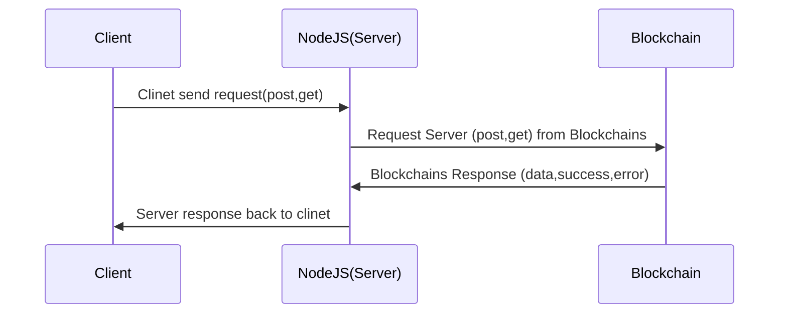
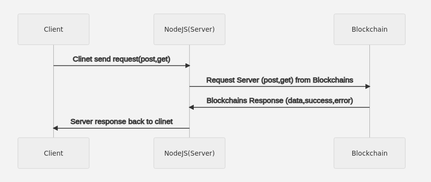
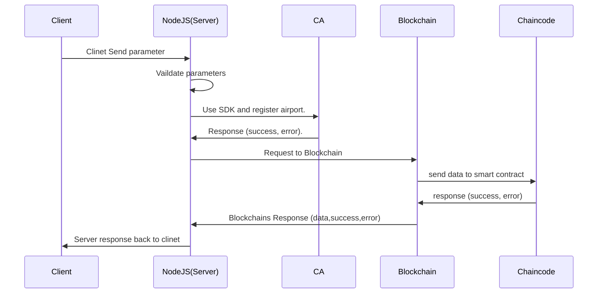
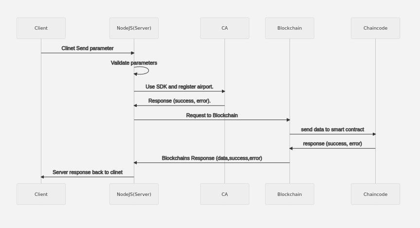
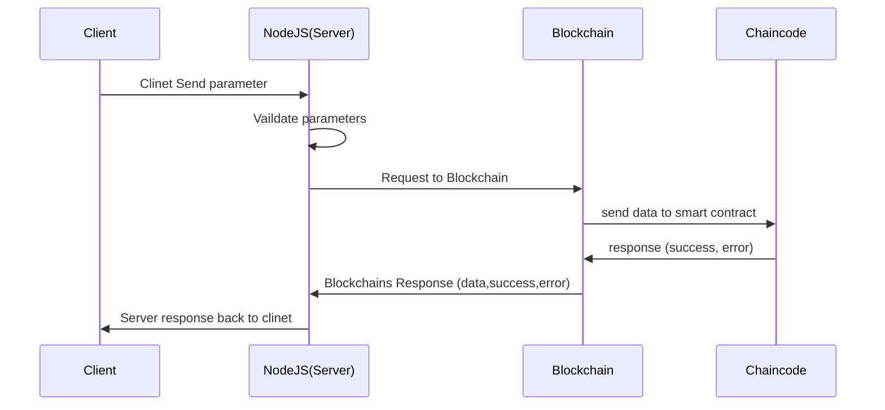
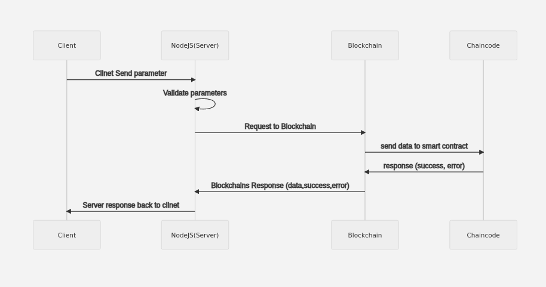

# Welcome to  Supply Chain Project Assignment.
### System workflow 
Follow Sequence Diagram show the complete work follow of system how system work and interact with back-end  Blockchain.
  

### Sequence Diagram 
-  System Workflow 

<p>
    
</p>

> This Diagram show simple follow of the application client interact with Blockhchain with help of Nodejs server and use there different REST API to perform Different actions. Details about API and their flow is given below.


### **_Folder Structure of the project_**
Following are the main folder of the project and their details:

1.  **artifacts** is folder name which contain most important files and folder of system like (docker-compose,certificate, channel, and most important smart contract(Chaincode) )
		- artifacts
		-->	channel (contain certificate and docker compose files)
		----> create-artifacts.sh file user to generate channel and certificates.
		--> src (chaincode) 
2.  **bin** contain fabric binaries.
3. **channel-artifacts** first channel block.
4.  **client** contain nodejs server file and fabric SDK files
		- client
		--> api (files like index.js and nodejs SDK to connect with fabric network)
		--> wallet (all user key and cert)
5.  **connection**  json file which have connection string which are used by SDK to connect with peer and orderer, and ca in Hyperledger network.

### **_Network Details_**
- **Orgainzations**(3)
	- Airport 
	- Airline
	- Interliner
- **Channel**
	- interlinerchannel
- **Orderer (3)**
- **Peer(2- in each org)**
- **CA (1 in each org)**

### **_How to start network and important file_**
Follow are the details about steps and important file which are used to start network.

#### **_Important Files Details**
1. **teardown.sh** file is used to down the existing network or remove all running containers.
2. **start_network.sh**  file is used to start network by up all the Peer, Orderer, Ca , Create Channel, Join  Channel
3.   **generate.sh** file used to generate certificate, channel block and genesis block
4. **envVar.sh** file used to export all the required variable.
5. **installchaincode.sh** used to install multiple chaincode by call a file deployChaincode 
6.  **deployChaincode.sh** used to install chaincode on all peer of all organization
7.  **createChannel.sh** used to create and join channel call by start_network file.

#### **Step to start Network**
>  #clear network
> ./teardown.sh
> #start container ,create channel and join channel
> ./start_network.sh
> #install chaincode
> ./installchaincode.sh

	 
 


### **_Nodejs Server and REST API_**
Once networ it start know time to start nodejs server, we have to create default user in system (Admin) to register different user based on their organization CA.
> node enrollAdminOrg1.js # connect with airline CA and generate admin cert for airline
>  node enrollAdminOrg2.js # connect with airline CA and generate admin cert for airport
>   node enrollAdminOrg3.js # connect with airline CA and generate admin cert for Interline
>   node registerinterliner.js used default user of interliner .
>   node app.js # will start nodejs server

Following are the API's and their details
####  RegisterAirports API
Register Airports  this API is used to register airport , create Certificate,Private Key , store in wallet folder and also store record in Blockchain .
	 - parameters are
		1.airportId
		2.location 
``` sh
http://localhost:8081/api/RegisterAirports 
```		


-  Register Airports 

<p>
    
</p>

> CA is used based on the orgainzation in which used belong to for Airport we will used airport orgainzation CA , MSP and also store Role of user.

####  RegisterAirlines API
Register Airlines  this API is used to register airlines , create Certificate,Private Key , store in wallet folder and also store record in Blockchain .
	 - parameters are
		1.airlinesid
		 
``` sh
http://localhost:8081/api/RegisterAirlines 
```		


-  Register Airlines 

<p>
    
</p>


####  CreateBaggage API
Create Baggage  this API is used to create Baggage store record in Blockchain .
	 - parameters are
		1. baggageId
		2. source
		3. destination
		4. path # this vaiable is json array of follow .
> [{"AirportId":"airport1","AirportStatus":false,"AirlineId":"PIA","AirlineStatus":false}]

``` sh
http://localhost:8081/api/CreateBaggage 
```		


####  ChangeBaggageStatusByAirport API
Change Baggage Status By Airport  this API is used to change the status of baggage , add fee and  store record in Blockchain .
	 - parameters are
		1. baggageId
		2. status
		3. fee
		4. airportId.
``` sh
http://localhost:8081/api/ChangeBaggageStatusByAirport 
```		


####  ChangeBaggageStatusByAirlines API
Change Baggage Status By Airlines  this API is used to change the status of baggage , add fee and  store record in Blockchain .
	 - parameters are
		1. baggageId
		2. status
		3. fee
		4. airlineId .
``` sh
http://localhost:8081/api/ChangeBaggageStatusByAirlines 
```		


####  GetBaggageDetails API
Get Baggage   this API is used to get baggage details , total  fee and  status which is recorded into  record in Blockchain .
	 - parameters are
		1. baggageId

``` sh
http://localhost:8081/api/GetBaggageDetails 
```		


### Get and Post API follows  


<p>
    
</p>


> postman collection is outside the folder name as **assignment-postman.json**

